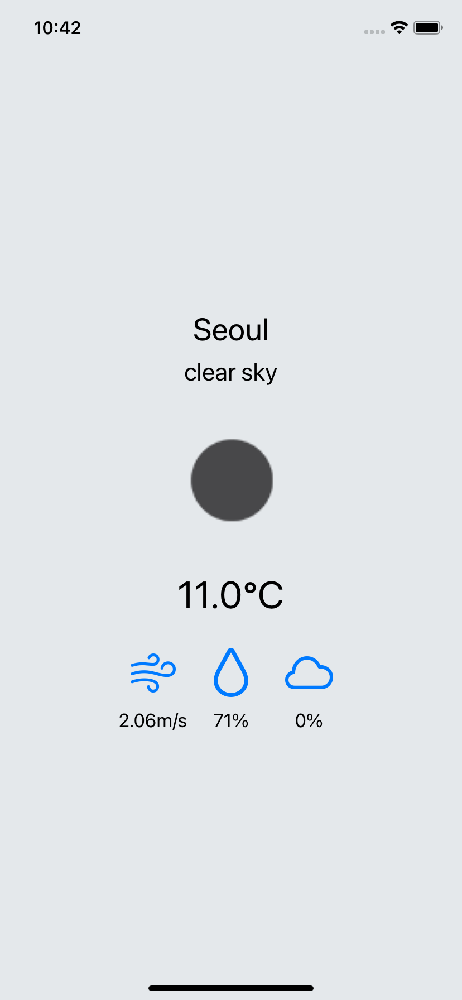

# RxWeatherApp

## Build

write your API key from OpenWeatherMap in `Service/OpenWeatherService.swift`

```swift
class OpenWeatherService {
    private static let apiKey = "{your API Key}"
    // ...
}
```

```
$ pod install
```

## Screenshot

